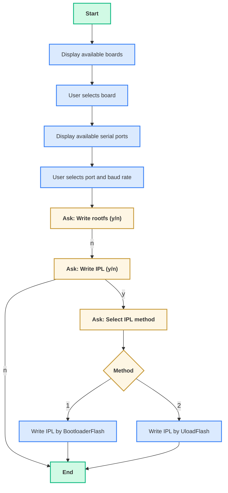

# universal-scripts

The **universal flash script** supports flashing RZ images across multiple boards by using information from a JSON configuration file.

This script offers cross-platform support (for both Windows and Linux operating systems) and handles three key flashing operations for embedded devices:

- Flashing the bootloader
- Flashing the uload-bootloader
- Flashing the Root Filesystem (rootfs) to an SD card

## Prerequisites:

- python
  - For Windows install: please refer to [this page](https://www.python.org/downloads/) to download the setup file.
  - For Linux install: `sudo apt install python3`

- python packages: Follows package is required to be using the flashing script. Please install if one of them is missing:

```
pip install pyserial
pip install dataclasses (if using python <3.7)
```

---

## JSON Configuration for a New Board

The `flash_images.json` file contains predefined image mappings for supported devices. Images must be located in the folder `universal-scripts/target/images`.

`flash_images.json` supports several default boards. You can add a custom board to the configuration file by providing the following information:

- **bl2**: BL2 image name
- **board_identification**: Board identification image name
- **fip**: FIP image name
- **flash_writer**: Flash Writer image name
- **ipl_flash_method**: Method used by the IPL bootloader for flashing (`qspi` or `emmc`)
- **rootfs**: Root filesystem image name (`*.wic`)
- **rootfs_flash_method**: Method to flash the SD card (`udp` or `otg`)

Example of a sample board configuration in JSON:

```json
"rzg2l-sbc": {
    "bl2": "bl2_bp-rzg2l-sbc.srec",
    "board_identification": "rzg2l-sbc-platform-settings.bin",
    "fip": "fip-rzg2l-sbc.srec",
    "flash_writer": "Flash_Writer_SCIF_rzg2l-sbc.mot",
    "ipl_flash_method": "qspi",
    "rootfs": "core-image-qt-rzg2l-sbc.wic",
    "rootfs_flash_method": "udp"
}
```

---

## Flowchart

The universal flash script prompts the user for options and proceeds through the flashing process based on the input. The detailed procedure is as follows:



---

## Basic Usage

### On Windows:

```bash
py universal_flash.py
```

### On Linux:

```bash
python3 universal_flash.py
```

---

## Notes

1. **Before flashing, ensure the board is powered off and the SD card is attached.**

2. **When selecting to write the rootfs or write the IPL using UloadFlash, make sure the boot switches are set to normal boot mode. When selecting to write the IPL using BootloaderFlash, set the switches to enter SCIF download mode.**
